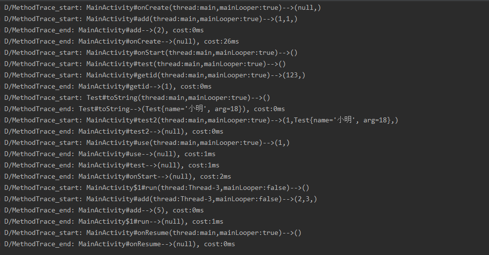

# Uatu

用于项目中方法替换和方法的跟踪(查看参数, 返回值, 方法耗时等).

## 用法

一:
root project `build.gradle`中添加:

```
classpath com.vinctor.plugin:uatu:0.2.0
```
二:
app module `build.gradle`中:

应用:
```
apply plugin: com.vinctor.uatu.UatuPlugin
```
添加配置:
```
UatuConfig {
    enable = true
    traceConfig {
        enable = true
        logAllArgs = true
        traceClass = 'com.vinctor.Trace'
        tracePackage = ['com.vinctor']
        exclude = ['com.vinctor.Uatu.test.TestExclude']
    }

    replaceConfig {
        enable = true
        configFile="replaceFile.json"
    }
}
```
配置参数说明:
```
UatuConfig->enable :插件配置是否可用(false:traceConfig和replaceConfig都不可用)
```
配置分为两部分: 方法跟踪和方法替换

1. 方法跟踪traceConfig:



```
enable     : 是否可用
logAllArgs : 是否输出方法的参数
traceClass : 方法跟踪的输出类(全限定名), 由使用者自行实现
tracePackage : 要跟踪的类列表(全限定名),  方法跟踪以类为单位, 添加到列表的类中的所有方法都会被跟踪
exclude : tracePackage中要排出的类列表
```
其中:

`traceClass` :方法跟踪的输出类, 该类为使用者自行实现, 其中必须实现两个静态方法,如下:

 ```
* 方法参数在start中, 方法返回值在end方法中,使用public修饰
* 可以在两者记录时间,计算差值即为方法耗时,
* 可以获取当前线程, 获取当先线程信息
* 判断Looper, 判断是否为主线程
* etc.(自由发挥)


/**
 * 当进入一个方法时会调用
 *
 * @param className 被跟踪的类名
 * @param method    被跟踪的方法名
 * @param signature 被跟踪的方法描述
 * @param args      被跟踪的方法参数
 * @return 用来识别方法唯一标识, randomUUID, 或int累加
 */
 public static String start(final String className, final String method, final String signature, Object[] args){}
 
/**
 * 当退出一个方法前会调用
 *
 * @param id        上面start方法返回的标识, 可根据标识判断是否为同一次进入方法
 * @param className 被跟踪的类名
 * @param method    被跟踪的方法名
 * @param signature 被跟踪的方法描述
 * @param returnObj 该方法的返回值
 */
 public static void end(String id, final String className, final String method, final String signature, final Object returnObj){}

 ```


